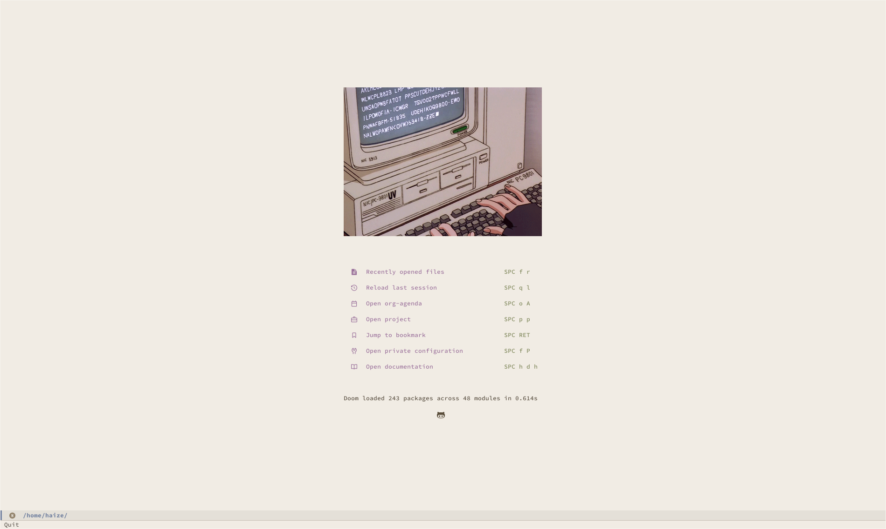

# hyprland - NixOS
buncha configs for stuff

## fonts
- Iosevka
- jetbrains nerd mono
- google-fonts
- font-awesome
## Doom Emacs

## Future work - Vim colour scheme
- for reference https://speakerdeck.com/cocopon/creating-your-lovely-color-scheme
- https://github.com/lifepillar/vim-colortemplate
