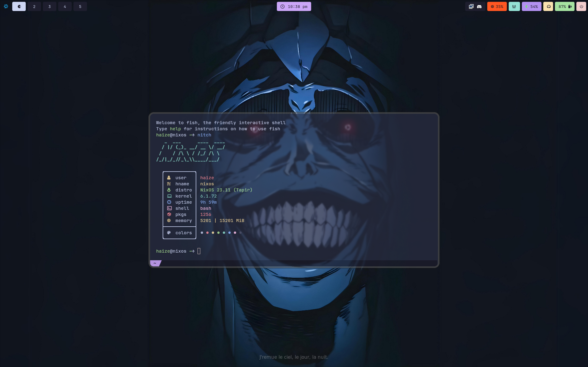

# hyprland - NixOS
buncha configs for stuff
# Current setup
[image](https://github.com/Haize-uwu/hyprland/assets/84086558/16865f52-7c99-4eff-88ff-c0cd44e378d4)

# old

## fonts
- Iosevka
- jetbrains nerd mono
- google-fonts
- font-awesome
## Doom Emacs

)

## Future work - Vim colour scheme
- for reference https://speakerdeck.com/cocopon/creating-your-lovely-color-scheme
- https://github.com/lifepillar/vim-colortemplate
